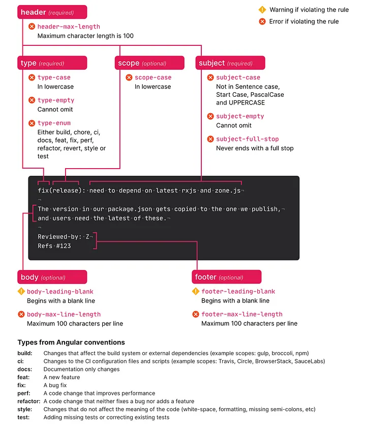

# Git Workflow Template

This repository aims at serving as a template for future development processes.

# Project Setup

We use the following tech stack for our project:

- [npm](https://www.npmjs.com/)

You can use the following links to install requirements:
- [Install npm](https://docs.npmjs.com/downloading-and-installing-node-js-and-npm)
  - It is recommended to use `nvm` to install and manage node and npm versions.

Once you install `npm` you can use the following command to install the dependencies for our Git workflow:

```bash
npm install
```

# Git Workflow

We use the following tools for enforcing developers to abide by [conventional commits](https://www.conventionalcommits.org/en/v1.0.0/#specification) 
standards, and automate semantic versioning.

- [Husky](https://typicode.github.io/husky/)
- [Commitlint](https://conventional-changelog.github.io/commitlint/)
- [GitHub Actions](https://docs.github.com/en/actions)

## Branching Strategy

Inspired by the following [guide](https://nvie.com/posts/a-successful-git-branching-model/) for a successful Git workflow, 
we use the following template as branch naming convention:

```bash
${type}/short-description
```

Branch type should be chosen based on the work you are aiming at doing in a branch. You can ask yourself the following
question: What kinds of commits am I going to be doing most of the time?
Branch type can be any of the following:

- feat
- fix
- hotfix **(only from master)**
- release
- build
- ci
- chore
- docs
- refactor
- revert
- style
- test

Additionally, try to use an imperative mood for short description in order to be compatible with commit messages.

## Commit Guidelines

Please comply with the specifications defined by conventional commits for your commit messages. 
[Commitlint](https://github.com/conventional-changelog/commitlint) already enforces developers
to stick with defined standards. Available commit types have been listed below in the text box. Based on the commit type
you choose, your project versioning will be affected! Therefore, it is very crucial for developers to  select an 
appropriate commit type.

The figure below summarizes the overall structure of a commit according to conventional commit specifications.



You can use `commitizen` for an easier commit experience which is a tool that guides you to structure your commit message
according to conventional commit standards. Use the following command to use in terminal:

```bash
npx cz
```

or if you installed `commitizen` globally:

```bash
git cz
```

### How To Write a Good Commit Message

1. Separate subject from body with a blank line
2. Limit the subject line to 50 characters
3. Capitalize the subject line
4. Do not end the subject line with a period
5. Use the imperative mood in the subject line
6. Wrap the body at 72 characters
7. Use the body to explain what and why vs. how

#### Commmit Template

```bash
# Title: $(type): $(short-description)
# Type: Please see below for commit types
# Short Description: Summary, imperative, start upper case, don't end with a period
# No more than 50 chars. #### 50 chars is here:  #

# Remember blank line between title and body.

# Body: Explain *what* and *why* (not *how*). Include issue ID.
# Wrap at 72 chars. ################################## which is here:  #


# At the end: Include Co-authored-by for all contributors. 
# Include at least one empty line before it. Format: 
# Co-authored-by: name <user@users.noreply.github.com>
#
# How to Write a Git Commit Message:
# https://chris.beams.io/posts/git-commit/
#
# 1. Separate subject from body with a blank line
# 2. Limit the subject line to 50 characters
# 3. Capitalize the subject line
# 4. Do not end the subject line with a period
# 5. Use the imperative mood in the subject line
# 6. Wrap the body at 72 characters
# 7. Use the body to explain what and why vs. how
```

You can use commit template before committing by the following and the template will appear in your favorite text editor:

```bash
git commit
```

However, we recommend using `commitizen` for automatic creation of commit message.

- Reference: https://cbea.ms/git-commit/


### Commit Types

A prefix for the commit message describing the type of change. The type is a noun. The following are the different types:

- **build**: Changes that affect the build system or external dependencies (example scopes: gulp, broccoli, npm)
- **ci**: Changes to CI configuration files and scripts (example scopes: Travis, Circle, BrowserStack, SauceLabs)
- **chore**: Changes which does not change source code or tests, e.g. changes to the build process, auxiliary tools, and libraries
- **docs**: Documentation only changes
- **feat**: A new feature 
- **fix**: A bug fix 
- **perf**: A code change that improves performance 
- **refactor**: A code change that neither fixes a bug nor adds a feature 
- **revert**: Revert something 
- **style**: Changes that do not affect the meaning of the code (white space, formatting, missing semi-colons, etc)
- **test**: Adding missing tests or correcting existing tests

## Issue && PR Templates

Please use the appropriate issue template for requesting either a feature or a bug fix when you are opening an issue.
Similarly, please fill the PR template carefully to inform others about your work.


## Customized .gitignore

Useful Resource: https://www.toptal.com/developers/gitignore